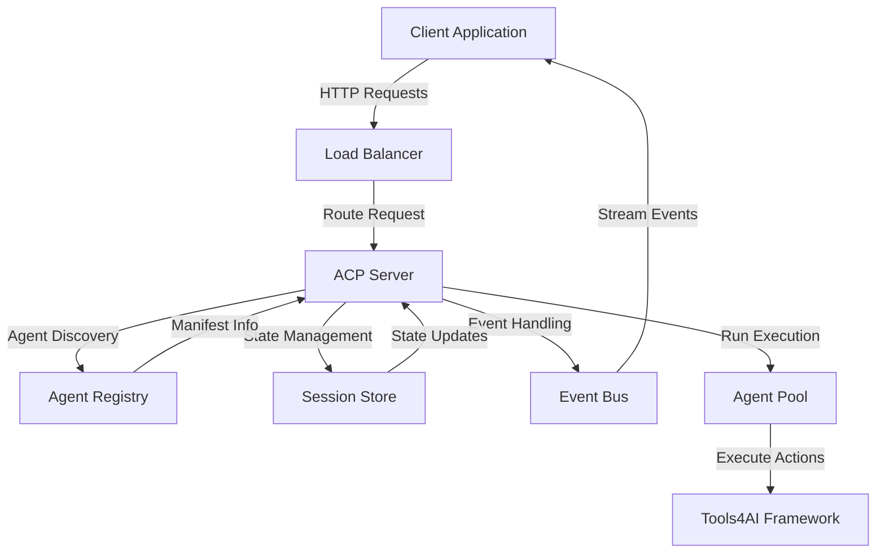
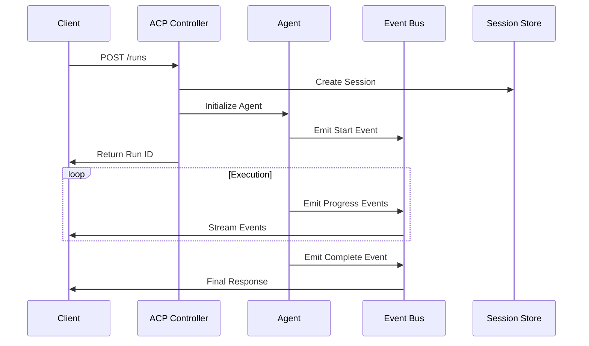
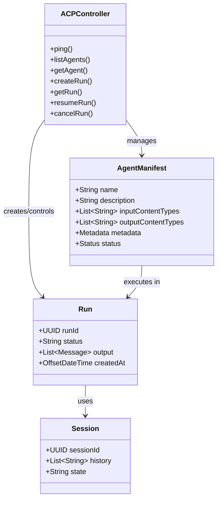
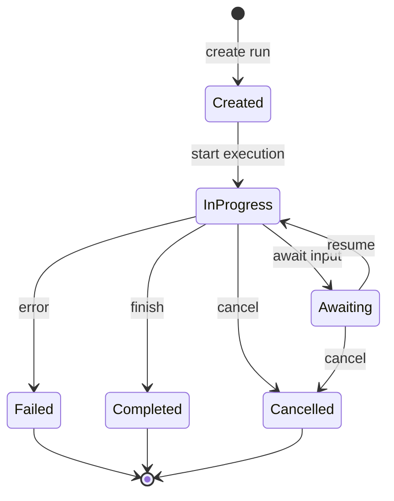

# ACP Architecture and Flow Diagrams

## System Architecture

```mermaid
graph TD
    Client[Client Application] --> |HTTP Requests| Load[Load Balancer]
    Load --> |Route Request| ACP[ACP Server]
    ACP --> |Agent Discovery| Registry[Agent Registry]
    ACP --> |State Management| Sessions[Session Store]
    ACP --> |Event Handling| Events[Event Bus]
    ACP --> |Run Execution| Agents[Agent Pool]
    Agents --> |Execute Actions| Tools[Tools4AI Framework]
    Events --> |Stream Events| Client
    Sessions --> |State Updates| ACP
    Registry --> |Manifest Info| ACP
```

## Request Flow

```mermaid
sequenceDiagram
    participant C as Client
    participant ACP as ACP Controller
    participant AG as Agent
    participant EV as Event Bus
    participant S as Session Store

    C->>ACP: POST /runs
    ACP->>S: Create Session
    ACP->>AG: Initialize Agent
    AG->>EV: Emit Start Event
    ACP->>C: Return Run ID
    loop Execution
        AG->>EV: Emit Progress Events
        EV->>C: Stream Events
    end
    AG->>EV: Emit Complete Event
    EV->>C: Final Response
```

## Component Architecture

```mermaid
classDiagram
    class ACPController {
        +ping()
        +listAgents()
        +getAgent()
        +createRun()
        +getRun()
        +resumeRun()
        +cancelRun()
    }
    class AgentManifest {
        +String name
        +String description
        +List~String~ inputContentTypes
        +List~String~ outputContentTypes
        +Metadata metadata
        +Status status
    }
    class Run {
        +UUID runId
        +String status
        +List~Message~ output
        +OffsetDateTime createdAt
    }
    class Session {
        +UUID sessionId
        +List~String~ history
        +String state
    }

    ACPController --> AgentManifest : manages
    ACPController --> Run : creates/controls
    Run --> Session : uses
    AgentManifest --> Run : executes in
```

## Event Flow

```mermaid
stateDiagram-v2
    [*] --> Created: create run
    Created --> InProgress: start execution
    InProgress --> Awaiting: await input
    Awaiting --> InProgress: resume
    InProgress --> Completed: finish
    InProgress --> Failed: error
    InProgress --> Cancelled: cancel
    Awaiting --> Cancelled: cancel
    Failed --> [*]
    Completed --> [*]
    Cancelled --> [*]
```
